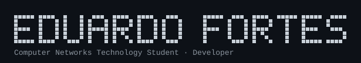

---

Studying at CTISM/UFSM, working across embedded systems, secure networking, and backend services.

**Now** — finishing my undergraduate thesis: an ESP32 + UHF RFID pipeline (EPC-Gen2) that talks to a C++ controller over MQTT/TLS, bridges to a FastAPI middleware over WebSocket, and surfaces on a real-time dashboard. Expected December 2026.

**Stack** — `node` `react` `typescript` `python` `c++` `mysql` `linux`

**Projects**

- [SistemaRFID-FREERTOS](https://github.com/EduardoRFortes/SistemaRFID-FREERTOS) — ESP32 modules rewritten to run on FreeRTOS
- [spec-windows](https://github.com/EduardoRFortes/spec-windows) — permission monitor for Claude Code on Windows, in Rust
- [CalculadoraFinanceira](https://github.com/EduardoRFortes/CalculadoraFinanceira) — a small GUI calculator in C++

---

[<picture><source media="(prefers-color-scheme: dark)" srcset="https://api.iconify.design/simple-icons/github.svg?color=white&height=22"><source media="(prefers-color-scheme: light)" srcset="https://api.iconify.design/simple-icons/github.svg?color=black&height=22"></picture>](https://github.com/EduardoRFortes)&nbsp; &nbsp;[<picture><source media="(prefers-color-scheme: dark)" srcset="https://api.iconify.design/simple-icons/linkedin.svg?color=white&height=22"><source media="(prefers-color-scheme: light)" srcset="https://api.iconify.design/simple-icons/linkedin.svg?color=black&height=22"></picture>](https://www.linkedin.com/in/eduardo-rodrigues-fortes-02a75b329/)&nbsp; &nbsp;[<picture><source media="(prefers-color-scheme: dark)" srcset="https://api.iconify.design/simple-icons/instagram.svg?color=white&height=22"><source media="(prefers-color-scheme: light)" srcset="https://api.iconify.design/simple-icons/instagram.svg?color=black&height=22"></picture>](https://www.instagram.com/im_fortes/)&nbsp; &nbsp;[<picture><source media="(prefers-color-scheme: dark)" srcset="https://api.iconify.design/simple-icons/gmail.svg?color=white&height=22"><source media="(prefers-color-scheme: light)" srcset="https://api.iconify.design/simple-icons/gmail.svg?color=black&height=22"></picture>](mailto:rodriguesfortes179@gmail.com)
